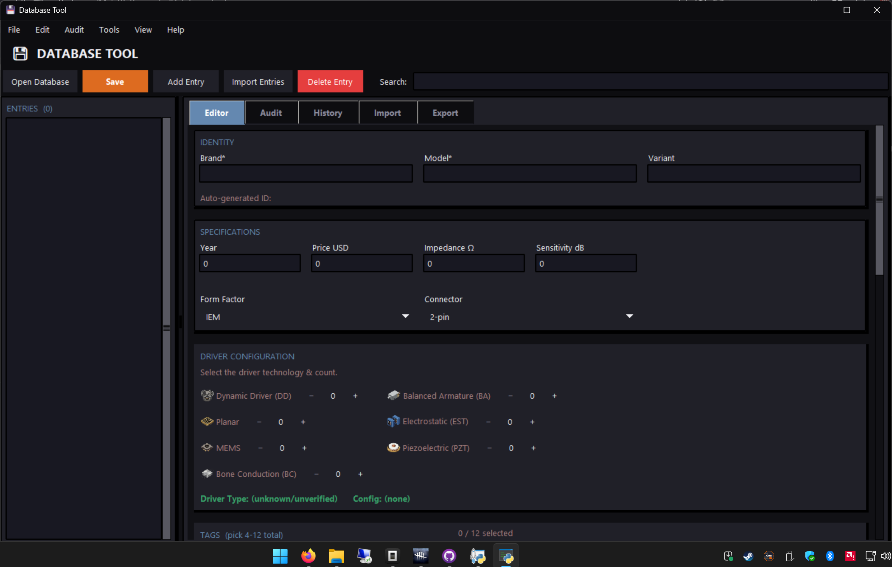

# Database Tool

A standalone desktop GUI for maintaining, auditing, importing, and exporting `database.json` — the catalog database used by **IEM Tool**.

Built entirely with Python and standard `tkinter`. It requires zero third-party packages to run.

<p align="center">
  
</p>

---

## Features

### Editor
- **Searchable entry tree:** Entries are grouped by brand with real-time filtering.
- **Autofill suggestions:** Brand, Model, and Variant suggest existing values.
- **Auto-generated IDs:** Normalizes Brand/Model/Variant into database-safe IDs.
- **Input validation:** Handles price rounding, driver configuration, connectors, form factors, and the 31 approved tags.
- **Measurement linking:** Links `.txt` measurement files with a live file count.
- **Offline spellcheck:** Checks Brand/Model/Variant without flagging names already in the database.
- **TWS lock:** Wireless Earbuds (TWS) zeroes and locks Impedance/Sensitivity.
- **Drag & drop:** Native file drag & drop on Windows.

### Import Curves
- Converts raw `.txt` / `.csv` measurements into the standard two-column format.
- Detects explicit measurement pairs and averages matching curves.
- Does not treat product names such as `Hype 2` or `MACH 2` as measurement pairs.
- Can automatically link converted files to the open entry.

### FR Curve Analysis
- Analyzes linked measurements and suggests bass, midrange, pinna gain, and treble tags.
- Supports multiple measurements and scientific notation.

### Database Audit & Repair
- Checks database structure, IDs, fields, years, tags, and specs.
- Finds missing, unlinked, and incorrectly-cased measurement paths.
- Batch-fixes common database issues.
- Limits large unlinked-file lists to 200 entries.

### Undo History & Backups
- **Undo/redo:** Tracks changes made during the current session.
- **Autosave backups:** Keeps the last 15 backups in `.db_editor_backups`.
- **Recovery:** Offers to restore a newer backup when available.
- Warns before undo/redo reloads entries with unsaved form changes.

### Export
- **Compress:** Creates `database.json.gz` for the website.
- **Split:** Creates token-sized `*_chunk_N.json` files for AI context windows.
- Exports include unsaved changes currently in the application.
- Old chunk files are cleaned up automatically.
- `.json.gz` files can be loaded for auditing.

---

## Running from Source

Requires **Python 3.8+**. `tkinter` is included with standard Python installations on Windows and macOS.

On Debian/Ubuntu Linux, install `tkinter` via:

```bash
sudo apt install python3-tk
```

### Run

```bash
python main.py
```

> **Note:** A `database.json` located in the working directory will load automatically.

---

## Building Executables

Building standalone executables requires [PyInstaller](https://pyinstaller.org/):

```bash
pip install pyinstaller
```

### Windows (.exe)

```bash
python -m PyInstaller --onefile --windowed --name "Database Tool" --icon="assets/icon.ico" --add-data "assets;assets" main.py
```

### macOS (.dmg) & Linux (.AppImage)

Build scripts are included in the repository:

```bash
chmod +x build_macos.sh build_linux_appimage.sh
./build_macos.sh
./build_linux_appimage.sh
```

---

## 🔗 Related Projects

* **[🎧 IEM Tool](https://github.com/MyLittlePrimordia/IEM-Tool):** The offline desktop app that uses this database for EQ, target matching, and discovery.
* **[📦 Database](https://github.com/MyLittlePrimordia/Database):** The official dataset repository where new measurements are merged, audited & maintained.