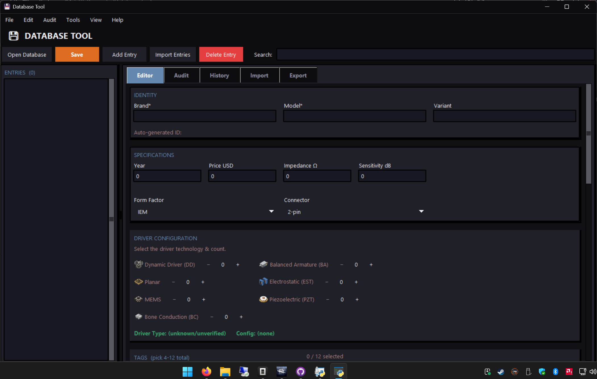

# 🛠️ Database Tool

**A lightweight, zero-dependency desktop GUI for managing and auditing the IEM Tool catalog.**

Add new IEMs, import frequency response curves, auto-detect sound signatures, and audit your database for broken links—with zero external Python packages to install.

<p align="center">
  
</p>

---

## ⚡ What it does

- ✏️ **Visual IEM Editor:** Search and edit entries grouped by brand. Features real-time search, smart autofill, spec validation, and offline spellcheck.
- 📈 **Smart Curve Importer:** Converts raw `.txt` or `.csv` measurements into clean curves, automatically pairs and averages L/R channels, and links them to entries.
- 🏷️ **Sound Signature Tagging:** Analyzes frequency response curves to automatically detect and tag bass, midrange, pinna gain, and treble profiles.
- 🩺 **1-Click Audit & Repair:** Scans for missing files, duplicate links, casing errors, and broken IDs—with batch auto-repair for common issues.
- 🛡️ **Safe & Reversible:** Complete undo/redo history and rotating autosave backups so you never lose work.
- 📦 **Ready to Export:** Compress directly to `database.json.gz` or split into token-sized chunks for AI context windows.

---

## 🚀 Quick Start

Built entirely with standard Python and `tkinter`—**no `pip install` required!**

### Prerequisites
- **Python 3.8+** (Windows & macOS include `tkinter` automatically)
- *Ubuntu/Debian Linux only:* `sudo apt install python3-tk`

### Launch the App
```bash
python main.py
```
> **Tip:** If a `database.json` file is in the same folder, it loads automatically on launch.

---

<details>
<summary><b>💻 Building Standalone Executables</b></summary>

To compile into a standalone `.exe`, `.dmg`, or `.AppImage` without needing Python installed:

First, install PyInstaller:
```bash
pip install pyinstaller
```

### Windows (.exe)
```bash
python -m PyInstaller --onefile --windowed --name "Database Tool" --icon="assets/icon.ico" --add-data "assets;assets" main.py
```

### macOS (.dmg) & Linux (.AppImage)
Use the included build scripts:
```bash
chmod +x build_macos.sh build_linux_appimage.sh
./build_macos.sh
./build_linux_appimage.sh
```
</details>

<details>
<summary><b>🔗 Related Projects</b></summary>

* **[🎧 IEM Tool](https://github.com/MyLittlePrimordia/IEM-Tool):** The main desktop app that uses this database for EQ, target matching, and discovery.
* **[📦 Database](https://github.com/MyLittlePrimordia/Database):** The official repository where measurement curves and `database.json` datasets are hosted.
</details>